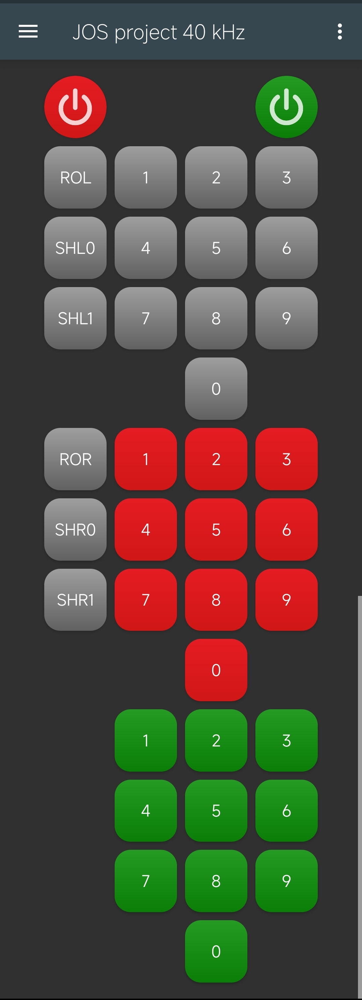

---
# pandoc --pdf-engine=xelatex --syntax-definition=syntax/console.xml report.md -o report.pdf

# Metadata
title: Języki Opisu Sprzętu - sprawozdanie
subtitle: 24. Odbiornik pilota IR
author: Krzysztof Dziembała
date: "2024-08-10"

# Pandoc document settings
standalone: true
lang: pl-PL
# Pandoc LaTeX variables
geometry: [a4paper, bindingoffset=0mm, inner=25mm, outer=25mm, top=25mm, bottom=25mm]
documentclass: report
fontsize: 12pt
colorlinks: true
numbersections: true
# toc: true
# lof: true # List of figures
# mainfont: Liberation Serif
# sansfont: Liberation Sans

header-includes:
  # # TikZ-timing package for timing diagrams
  # - |
  #   ````{=latex}
  #   \usepackage{tikz-timing}
  #   ````
  # # TikZ-timing: set background for D (data) to the same as on the lecture slides #FFFFCC
  # - |
  #   ````{=latex}
  #   \tikzset{timing/d/background/.style={fill={rgb,255:red,255; green,255; blue,204}}}
  #   ````
  # Remove "Chapter N" from the line above chapter name in report class document
  # I could not include a file for some reason, but this works
  - |
	````{=latex}
	\usepackage{titlesec}
	\titleformat{\chapter}
	  {\normalfont\LARGE\bfseries}{\thechapter.}{1em}{}
	\titlespacing*{\chapter}{0pt}{3.5ex plus 1ex minus .2ex}{2.3ex plus .2ex}
	````
  # Keep footnote numbering
  - |
	````{=latex}
	\counterwithout{footnote}{chapter}
	````
  # Packages required for Logisim tables
#   - |
#     ````{=latex}
#     \usepackage{colortbl}
#     \usepackage[dvipsnames]{xcolor}
#     \usepackage{tikz-timing}
#     \usepackage{tikz}
#     \usetikzlibrary{karnaugh}
#     ````
  # Wrap long source code lines
  - |
	````{=latex}
	\usepackage{fvextra}
	\DefineVerbatimEnvironment{Highlighting}{Verbatim}{breaklines,commandchars=\\\{\}}
	````
  - |
	````{=latex}
	\usepackage{pdfpages}
	````
  # Custom font (Noto) and icons
  - |
	````{=latex}
	\usepackage{noto}
	\usepackage{fontawesome}
	````
  # \FloatBarrier
  - |
	````{=latex}
	\usepackage{placeins}
	````
  # Force position
  - |
	````{=latex}
	\usepackage{float}
	%\makeatletter
	%\def\fps@figure{H}
	%\makeatother
	````
---

<!-- Allow multiple top-level headers (interpreted as chapters by pandoc) -->
<!-- markdownlint-disable MD025 -->
# Cel projektu

Celem projektu było stworzenie układu umożliwiającego sterowanie diodami LED za pomocą sygnałów wysyłanych przez pilot korzystający z podczerwieni. Założenia obejmowały:

1. wykorzystanie odbiornika IR znajdującego się na płytce DE1-SoC (`IRM-V538/TR1`),
2. detekcję ramki w formacie SONY lub NEC,
3. wyświetlanie odebranych danych w formacie szesnastkowym na wyświetlaczach siedmiosegmentowych,
4. obsługę prostych sygnałów sterujących diodami LED (zapalanie, gaszenie, przesuwanie, itp.).

\begingroup
\renewcommand{\cleardoublepage}{}
\renewcommand{\clearpage}{}
# Analiza problemu
\endgroup

## Wybór protokołu IR

Ponieważ zadanie dopuszczało różne standardy komunikacji z wykorzystaniem podczerwieni, pierwszym krokiem było ustalenie który zostanie użyty w projekcie.

| | Sony (SIRC) | NEC |
| - | - | - |
| **Częstotliwość nośna** | 40 kHz | 38 kHz |
| **Start** | 2,4 ms + 600 μs | 9 ms + 4,5 ms |
| **_"0"_** | 600 μs + 600 μs | 562,5 μs + 562,5 μs |
| **_"1"_** | 1,2 ms + 600 μs | 562,5 μs + 1,6875 ms |
| **Koniec** | _brak_ | 562,5 μs |
| **Adres** | 5 bitów | 8 bitów |
| **Rozkaz** | 7 bitów | 8 bitów |
| **Kolejność bitów w segmencie** | Od LSB do MSB | Od LSB do MSB |
| **Format ramki** | _Start Rozkaz Adres_ | _Start Adres \~Adres Rozkaz \~Rozkaz Koniec_ |

Format Sony jest dużo prostszy od formatu NEC, podczas gdy 7 bitów na rozkaz jest wystarczające do zakodowania wszystkich potrzebnych poleceń. Na niekorzyść tego formatu przemawia częstotliwość nośna, która nie pokrywa się z częstotliwością demodulowania odbiornika, jednak mimo to może być ona poprawnie odebrana.

## Mikroarchitektura

Rysunek \ref{fig:arch} przedstawia zamysł architektury projektu. Kluczowymi elementami są moduły `ir_receiver` oraz `led_mgr`, odpowiedzialne za odbieranie danych oraz przetwarzanie komend. Schematy RTL wygenerowane na podstawie opisu widoczne są na rysunkach \ref{fig:arch-yosys} i \ref{fig:arch-quartus}.


# Szczegóły implementacji

Kod źródłowy projektu oraz tego sprawozdania dostępny jest również na platformie GitHub [\faGithub krzysdz/JOS-proj-2024](https://github.com/krzysdz/JOS-proj-2024).

## Moduł `top`

Moduł odpowiada za połączenia między modułami, wejściami oraz wyjściami. Implementuje również prosty wykrywacz narastających zbocz, ktory działa jako _enable_ dla `led_mgr` oraz rejestru przechowującego ostatnią poprawną komendę. Dokładniej przedstawiony na rysunkach \ref{fig:arch-yosys} i \ref{fig:arch-quartus}.

## Moduł `ir_receiver`

Zadaniem tego modułu jest dekodowanie sygnału odebranego przez odbiornik podczerwieni, aby umożliwić jego dalsze przetwarzanie.

```verilog
module ir_receiver #(
    parameter integer BASE_PULSE_WIDTH = 30000,
    // > In general all IR equipment is forgiving and operates with in a timing tolerance of +/- 10%.
    parameter real ERROR_MARGIN = 0.1 // 10% by default
) (
    input clk,
    input ir_in,
    output reg[11:0] data,
    output reg data_rdy
);
```

#### Parametry `ir_receiver` {-}

- `BASE_PULSE_WIDTH` - określa ilość cykli zegara, którą powinien trwać najkrótszy impuls (600 μs) odpowiadający bitowi _"0"_ oraz przerwie pomiędzy bitami. 30000 to 0,6 ms dla zegara 50 MHz,\
- `ERROR_MARGIN` (w skali 0.0-1.0) - określa dopuszczalny odchył w czasie transmisji. Źródła dostępne w internecie ([Barry V. Gordon, _"Learned IR Code Display Format"_](https://web.archive.org/web/20220315074837/http://the-gordons.net/homepage/DownLoad.html)) sugerują $\pm 10\%$ jako typową wartość.

#### Wejścia `ir_receiver` {-}

- `clk` - zegar,
- `ir_in` - sygnał z odbiornika podczerwieni. Wysoki gdy nic nie jest odbierane, _"0"_ gdy do odbiornika dociera podczerwień.

#### Wyjścia `ir_receiver` {-}

- `data` - odebrana 12-bitowa ramka. Najwyższe 5 bitów (`[11:7]`) to adres, pozostałe 7 (`[6:0]`) jest rozkazem,
- `data_rdy` - flaga określająca czy wyjście `data` w danym momencie zawiera prawidłowe dane. Flaga jest ustawiana po pomyślnym odebraniu transmisji i czyszczona gdy zostanie odebrany pierwszy bit kolejnej wiadomości.

#### FSM{-}

W celu przetwarzania sygnału zastosowano automat z 4 stanami, przedstawiony na rysunku \ref{fig:fsm}. Przejścia między stanami zależą od wejścia podczerwieni oraz czasu w nich spędzonego (t). `BASE{,2,4}_{MIN,MAX}` to wartości wyliczone na podstawie [parametrów](#parametry-ir_receiver) `BASE_PULSE_WIDTH` oraz `ERROR_MARGIN` odpowiadające czasom 0,6, 1,2 oraz 2,4 ms.


Pomimo zakodowania 4 stanów na 2 bitach, w trakcie pierwszych testów automat potrafił się _zablokować_ ze względu na asynchroniczny sygnał `ir` oraz inny sposób kodowania stanów po syntezie. Problem został naprawiony przez synchronizację sygnału.

## Format poleceń, moduł `led_mgr`

Moduł `led_mgr` odpowiedzialny jest za sterowanie diodami LED zgodnie z otrzymywanymi poleceniami. Polecenia wykonywane są gdy `new_cmd` jest w stanie wysokim, a 5 najwyższych bitów polecenia równe jest wartości parametru `DEV_ADDR`.

Format poleceń można przedstawić w następujący sposób

```plain
11 10 9 8 7 | 6 5 4 | 3 2 1 0
\          / \     / \      /
  address      cmd     data
```

- `address` - adres urządzenia
- `cmd` - określa rodzaj polecenia (opisane w sekcji [Parametry `led_mgr`](#parametry-led_mgr))
- `data` - parametr polecenia, np. indeks diody lub rodzaj przesunięcia

```verilog
module led_mgr #(
    parameter DEV_ADDR = 5'h0C,
    parameter CMD_OFF = 3'b100,
    parameter CMD_ON  = 3'b101,
    parameter CMD_SHL = 3'b010,
    parameter CMD_SHR = 3'b011,
    parameter CMD_TGL = 3'b001,
    parameter CMD_RST = 3'b110,
    parameter CMD_SET = 3'b111,
    parameter CMD_NOP = 3'b000,
    parameter SHIFT_ROT = 4'b1xxx,
    parameter SHIFT_C0  = 4'b0xx0,
    parameter SHIFT_C1  = 4'b0xx1
) (
    input clk,
    input new_cmd,
    input[11:0] cmd_buf,
    output reg[9:0] leds
);
```

#### Parametry `led_mgr` {-}

- `DEV_ADDR` - określa 5-bitowy adres urządzenia. Polecenie zostanie wykonane tylko jeśli zawarty w nim adres pokrywa się z tym parametrem.

Parametry określające kodowanie komend (bity `[6:4]`):

- `CMD_OFF` - zgaś LED o indeksie `data`,
- `CMD_ON` - włącz LED o indeksie `data`,
- `CMD_SHL` - przesuń LEDy o 1 w lewo; stan `LED0` zależny od `data` oraz parametrów `SHIFT_` opisanych poniżej,
- `CMD_SHR` - przesuń LEDy o 1 w prawo; stan `LED9` zależny od `data` oraz parametrów `SHIFT_` opisanych poniżej,
- `CMD_TGL` - przełącz stan diody o indeksie `data`,
- `CMD_RST` - wyłącz wszystkie diody,
- `CMD_SET` - zaświeć wszystkie diody,
- `CMD_NOP` - nie rób nic; parametr istnieje tylko po to aby wyczerpać wszystkie 8 kombinacji.

Parametry określające zachowanie przy przesunięciu w zależności od `data`. Wykorzystywane jest `casex`, więc mogą obejmować wiele wartości `data`:

- `SHIFT_ROT` - obracanie, przesunięcie z _zawijaniem_; stan `LED0`/`LED9` zależy od stanu `LED9`/`LED0` przed przesunięciem,
- `SHIFT_C0` - wypełnienie _"0"_; `LED0`/`LED9` będzie zgaszone,
- `SHIFT_C1` - wypełnienie _"1"_; `LED0`/`LED9` będzie włączone.

#### Wejścia `ir_receiver` {-}

- `clk` - zegar,
- `new_cmd` - _enable_, komendy przetwarzane są tylko gdy wejście jest w stanie wysokim,
- `cmd_buf` - 12-bitowe polecenie składające się z 5-bitowego adresu i 7-bitowego rozkazu, format opisany [powyżej](#format-poleceń-moduł-led_mgr).

#### Wyjścia `ir_receiver` {-}

- `leds` - stan 10 diod LED, którymi zarządza moduł.

## Pilot

Jako pilot został wykorzystany telefon z diodą IR i aplikacją pozwalającą na dodawanie własnych pilotów ([IR Remote](https://gitlab.com/divested-mobile/irremote)).

{ width=53% }

Ponieważ pełny pilot wymaga 38 przycisków ($3 \times 10$ na cyfry, $2 \times 3$ na przesunięcia oraz włącz/wyłącz), jak można zauważyć na rysunku \ref{fig:remote}, a każdy przycisk wymaga podania pełnej sekwencji określającej czas transmisji oraz przerw, został on wygenerowany za pomocą skryptu. Skrypt ten umożliwia również stworzenie pilota wykorzystującego częstotliwość nośną 38 kHz, zachowując czasy transmisji zgodny z protokołem SIRC, na wypadek gdyby odbiornik nie był w stanie zdemodulować 40 kHz.

Pełne opcje skryptu generującego pilot można uzyskać komendą `python remote_generator.py --help`:

```plain
usage: remote_generator.py [-h] [-v] [-r REMOTE] [-a ADDRESS]
                           [-f FREQUENCY] [-t TIME | -n PULSES]
                           [outfile]

JSON remote file generator for the IR Remote
(https://gitlab.com/divested-mobile/irremote,
https://f-droid.org/packages/us.spotco.ir_remote) app

positional arguments:
  outfile               output file, printing to STDOUT if not
                        provided

options:
  -h, --help            show this help message and exit
  -v, --verbose
  -r REMOTE, --remote REMOTE, --name REMOTE
                        name of the remote
  -a ADDRESS, --address ADDRESS
                        5-bit device address, 12 (0b01100) by
                        default
  -f FREQUENCY, --frequency FREQUENCY
                        carrier frequency in Hz, 40000 by
                        default
  -t TIME, --time TIME, --duration TIME
                        base pulse duration in μs, 600 by
                        default (0.6 ms)
  -n PULSES, --pulses PULSES
                        base pulse duration represented as
                        number of pulses at the carrier
                        frequency
```

\begingroup
\renewcommand{\cleardoublepage}{}
\renewcommand{\clearpage}{}
# Testy
\endgroup

## Testy praktyczne

Testy praktyczne wykazały problem polegający na okazjonalnym i powtarzalnym zatrzaskiwaniu się automatu (moduł `ir_receiver`) w jakimś stanie (żadnym ze zdefiniowanych) w trakcie odbierania sygnału. Problem został rozwiązany przez przepuszczenie sygnału z odbiornika przez pojedynczy przerzutnik D.

Po naprawie problemu dokonane zostały testy funkcjonalności. Wszystkie polecenia były poprawnie wykonywane. Do testów wykorzystano głównie pilot korzystający z nośnej 40 kHz (zgodnie z protokołem SIRC), który działał bez zarzutu. Pilot 38 kHz również działał poprawnie, choć nie jest on w pełni zgodny z wybranym na początku protokołem.


## Testbench

Oprócz testów praktycznych, najważniejsze moduły, to jest `ir_receiver` oraz `led_mgr`, zostały sprawdzone testbenchami.

### Testbench `led_mgr`

Test sprawdzał poprawność wykonywania poleceń:

- `CMD_SET`
- `CMD_TGL` dwukrotnie, z różnymi indeksami
- `CMD_OFF`
- `CMD_RST`
- `CMD_ON`
- `CMD_SHR` we wszystkich wariantach
- `CMD_SHL` we wszystkich wariantach

Sprawdzono również czy moduł reaguje tylko na rozkazy posiadające prawidłowy adres, poprzez wysłanie polecenia na adres `0x1A`, różny od ustalonego `0x0C`. Testy wskazały również poprawne działanie `new_cmd` jako _enable_.

Wykres czasowy testu widoczny jest na rysunku \ref{fig:tb_led}. `cmd` pokazuje zdekodowane pełne polecenia (łącznie z adresem). `address`, `op` i `d` to wewnętrzne sygnały, _wyciągnięte_ z `cmd`. `op` dekodowane jest za pomocą prostego podstawienia w GTK Wave, `cmd` wykorzystuje osobno napisany w tym celu program ([traces/cmd_decoder](https://github.com/krzysdz/JOS-proj-2024/tree/main/traces/cmd_decoder)).


Logi wyświetlają wysyłane komendy oraz stan po ich odebraniu.

```console
$ vvp .\out\led_mgr_tb
VCD info: dumpfile out/led_mgr_tb.vcd opened for output.
0: xxxxxxxxxx
All on
30: 1111111111
Toggle LED 3
70: 1111110111
LED 5 off
110: 1111010111
All off
150: 0000000000
LED 7 on
170: 0010000000
Toggle LED 1
190: 0010000010
Rotate right
210: 0001000001
Rotate right
230: 1000100000
Shift right (fill with 0)
250: 0100010000
Shift right (fill with 1)
270: 1010001000
Rotate left
290: 0100010001
Rotate left
310: 1000100010
Shift left (fill with 0)
330: 0001000100
Shift left (fill with 1)
350: 0010001001
Different address (nothing happens)
led_mgr_tb.v:70: $finish called at 385 (1ns)
```

### Testbench `ir_receiver`

Testy tego modułu obejmują transmisję jednej 12-bitowej ramki (`0xF0D`, binarnie `0b111100001101`) oraz urwany transfer, po którym automat wraca do stanu `S_IDLE`.

<!-- \makeatletter
\def\fps@figure{H}
\makeatother -->


Logi prezentują zmiany sygnałów `ready` i `data` w trakcie transmisji.

```console
$ vvp out/ir_receiver_tb
VCD info: dumpfile out/ir_receiver_tb.vcd opened for output.
0: (x) WAIT  xxxxxxxxxxxx
4300030: (0) WAIT  1xxxxxxxxxxx
5500030: (0) WAIT  01xxxxxxxxxx
7300030: (0) WAIT  101xxxxxxxxx
9100030: (0) WAIT  1101xxxxxxxx
10300030: (0) WAIT  01101xxxxxxx
11500030: (0) WAIT  001101xxxxxx
12700030: (0) WAIT  0001101xxxxx
13900030: (0) WAIT  00001101xxxx
15700030: (0) WAIT  100001101xxx
17500030: (0) WAIT  1100001101xx
19300030: (0) WAIT  11100001101x
21100030: (0) WAIT  111100001101
22420070: (1) READY 111100001101
Sent: f0d, received: f0d
27700030: (0) WAIT  011110000110
ir_receiver_tb.v:49: $finish called at 30100000 (1ns)
```

\FloatBarrier

\includepdf[fitpaper=true]{diagrams/ir_receiver_custom.pdf}
